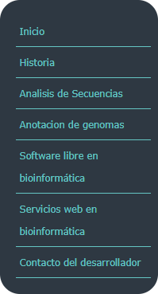

| **1.** Se pide realizar el tutorial02 del texto guía New Perspectives HTML5 and CSS3, 7th Edition. El desarrollo del tutorial se debe incluir en el informe de la práctica (detallado). |
|-----------------------------------------------------------------------------------------------------------------------------------------------------------------------------------------|

>   **2.** Se recomienda utilizar, en al menos una página HTML, un diseño a dos
>   columnas con cabecera y pie de página, como el que se muestra en la Figura
>   2.

| **3.** Así, como también se recomienda utilizar, en al menos una página HTML, un diseño a tres columnas con cabecera y pie de página como se muestra en la Figura 3. |
|----------------------------------------------------------------------------------------------------------------------------------------------------------------------|

| **4.** De igual manera, se pide que se creé al menos tres archivos CSS, estos archivos estarán almacenados en una carpeta llamada css. Un archivo será para el diseño a dos columnas, otro archivo para el diseño a tres columnas, y los demás archivos será para la reglas CSS relacionas a textos, colores, tablas, secciones, artículos, etc. |   |
|--------------------------------------------------------------------------------------------------------------------------------------------------------------------------------------------------------------------------------------------------------------------------------------------------------------------------------------------------|---|
| **5.** Asimismo, se pide que se personalice todos los hipervínculos usando pseudo-clases.                                                                                                                                                                                                                                                        |   |

| **6.** También, se pide que se cree un menú vertical (navegación) para todas las páginas. El menú debe tener bordes ovalados, con color de fondo y una separación entre cada menú de al menos 5px. |
|----------------------------------------------------------------------------------------------------------------------------------------------------------------------------------------------------|

| **7.** De igual manera, se pide crear una nueva página HTML, en donde, se muestre un formulario de contacto que tenga los siguientes campos (nombre, correo electrónico, mensaje y botón para enviar). |   |
|--------------------------------------------------------------------------------------------------------------------------------------------------------------------------------------------------------|---|

1.  Finalmente, se pide que en toda la práctica existan al menos 100 reglas CSS
    únicas.

    1.  **Active**

    2.  **Background-color**

    3.  **Block**

    4.  **Border**

    5.  **Border-bottom**

    6.  **Border-radius**

    7.  **Both**

    8.  **Clear**

    9.  **Color**

    10. **Display**

    11. **Float**

    12. **Float**

    13. **Font**

    14. **Font-family**

    15. **Font-size**

    16. **Hover**

    17. **Left**

    18. **Line-height**

    19. **Link**

    20. **List-style**

    21. **List-style-type**

    22. **Margin**

    23. **Margin-left**

    24. **Margin-right**

    25. **Max-width**

    26. **Min-width**

    27. **None**

    28. **Padding**

    29. **Rigth**

    30. **Text-align**

    31. **Text-decoration**

    32. **Visited**

    33. **Widht**

    34. **Z-index**

    35. **Margin-top**

2.  . Al finalizar la práctica se debe validar todas las páginas HTML y hojas de
    estilos CSS creadas usando el W3C Validator.

>   **Index**

>   **Contacto.html**

>   **SLBioinformatica.html**

>   **SWBioinformatica.html**

| **SigloXXI.html** |
|-------------------|

>   **AnalisisSecuencias.html**

>   **AnotaciónGenomas.html**

>   **Usuario: ChristianY1**

>   **Practica02-Mi-Sitio-Web-CSS:**
>   <https://github.com/ChristianY1/Practica02-Mi-Sitio-Web-CSS-> Tutorial 2:
>   <https://github.com/ChristianY1/Tutorial-02---1TriAndSuccedSports>
